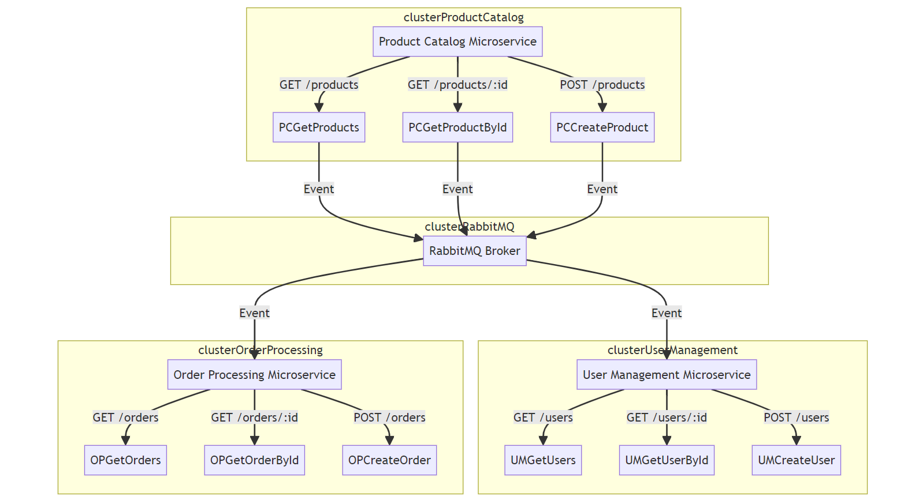

# S1-23-CCZG504: Microservices Application Product Catalog, User Management, and Order Processing

## Group Details
### Group 6	
1. **2022mt03574- S S Pavan Kumar Marla**
2. **2022mt03606- Leela Kumari A**
3. **2022mt03584- Madhavan R**
4. **2022mt03520- Venkatesh Kodari**

This contains a basic example of three microservices: Product Catalog, User Management, and Order Processing. 
The services communicate via RabbitMQ for event-driven interactions.


1. **Product Catalog Microservice**
   - Manages the catalog of products available in the system.

2. **User Management Microservice**
   - Handles user-related functionalities, such as user registration and user information retrieval.

3. **Order Processing Microservice**
   - Manages the processing of customer orders.

## Architecture 




## Table of Contents

- [Prerequisites](#prerequisites)
- [Getting Started](#getting-started)
  - [Docker Configuration](#docker-configuration)
  - [Kubernetes Deployment](#kubernetes-deployment)
- [Usage](#usage)
- [Endpoints](#endpoints)
- [Development](#development)
- [Contributing](#contributing)
- [License](#license)

## Prerequisites

Before you begin, ensure you have met the following requirements:

- Node.js and npm installed
- Docker installed (for local development)
- Kubernetes cluster set up (for deployment)
- Minikube installed (for local development)
- MongoDB installed and running locally
- Rabbitmq installed and running locally

## Running Minikube

1. Install Minikube by following the instructions in the [official documentation](https://minikube.sigs.k8s.io/docs/start/).

2. Start Minikube:

```bash
   minikube start
```

### Minikube options:

1. Check the status of the Minikube cluster:

```bash
minikube status
```

2. Access the Kubernetes dashboard:

```bash
minikube dashboard
```

3. Get the Minikube cluster IP:

```bash
minikube ip
```

4. Stop the Minikube cluster:

```bash
minikube stop
```

## Getting Started

### Docker Configuration

1. Build the Docker images for each microservice:

```bash
   docker build -t dockerhub-username/product-catalog:latest ./product-catalog
   docker build -t dockerhub-username/user-management:latest ./user-management
   docker build -t dockerhub-username/order-processing:latest ./order-processing
```


2. Push the Docker images to DockerHub: 
```bash
    docker push your-dockerhub-username/product-catalog:latest
    docker push your-dockerhub-username/user-management:latest
    docker push your-dockerhub-username/order-processing:latest
```

### Kubernetes Deployment
1. Load the images into minikube docker
```bash   
   minikube image load your-dockerhub-username/product-catalog:latest
   minikube image load your-dockerhub-username/user-management:latest
   minikube image load your-dockerhub-username/order-processing:latest
```
   
3. Apply the Kubernetes deployment files:

```bash
    kubectl apply -f product-catalog-deployment.yaml
    kubectl apply -f user-management-deployment.yaml
    kubectl apply -f order-processing-deployment.yaml
```

4. Monitor the deployment:

```bash
kubectl get pods
kubectl get services
minikube ip
```

### Usage

Access the microservices through the exposed services in your Kubernetes cluster.
Use the provided endpoints (documented below) to interact with each microservice.

### Endpoints
http:<minikube-ip>:<nodePort>

#### Product Catalog Microservice

1. GET /products: Retrieve the list of products.
2. GET /products/{id}: Retrieve details of a specific product.
3. POST /products: Add a new product.


#### User Management Microservice

1. GET /users: Retrieve the list of users.
2. GET /users/{id}: Retrieve details of a specific user.
3. POST /users: Add a new user.


#### Order Processing Microservice

1. GET /orders: Retrieve the list of orders.
2. GET /orders/{id}: Retrieve details of a specific order.
3. POST /orders: Place a new order.

### Development

- Each microservice is developed independently.


